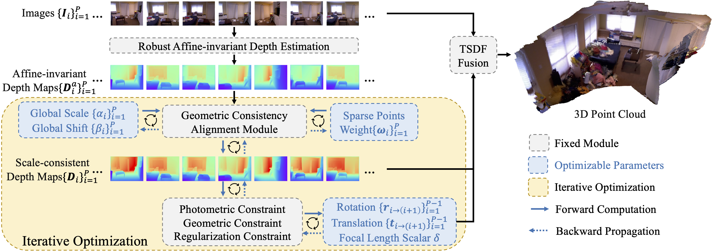

<div align="center">

<h1>FrozenRecon: Pose-free 3D Scene Reconstruction with Frozen Depth Models </h1>

[Guangkai Xu](https://github.com/guangkaixu/)<sup>1*</sup>, &nbsp; 
[Wei Yin](https://yvanyin.net/)<sup>1*</sup>, &nbsp; 
[Hao Chen](https://stan-haochen.github.io/)<sup>1*</sup>, &nbsp;
[Chunhua Shen](https://cshen.github.io/)<sup>1</sup>, &nbsp;
[Kai Cheng](https://cklibra.github.io/)<sup>2</sup>, &nbsp;
[Feng Zhao](https://scholar.google.co.uk/citations?user=r6CvuOUAAAAJ&hl=en/)<sup>1</sup>

<sup>1</sup>University of Science and Technology of China &nbsp;&nbsp; 
<sup>2</sup>DJI Technology &nbsp;&nbsp; 
<sup>3</sup>Zhejiang University

### [Project Page](https://aim-uofa.github.io/FrozenRecon/) | [arXiv]()


</div>

## 🖼️ Demo
<div align="center">

</div>

## 📖 Abstract

3D scene reconstruction is a long-standing vision task. Existing approaches can be categorized into geometry-based and learning-based methods. The former leverages multi-view geometry but can face catastrophic failures due to the reliance on accurate pixel correspondence across views. The latter was proffered to mitigate these issues by learning 2D or 3D representation directly. However, without a large-scale video or 3D training data, it can hardly generalize to diverse real-world scenarios due to the presence of tens of millions or even billions of optimization parameters in the deep network. Recently, robust monocular depth estimation models trained with large-scale datasets have been proven to possess weak 3D geometry prior, but they are insufficient for reconstruction due to the unknown camera parameters, the affine-invariant property, and inter-frame inconsistency. Here, we propose a novel test-time optimization approach that can transfer the robustness of affine-invariant depth models such as LeReS to challenging diverse scenes while ensuring inter-frame consistency, with only dozens of parameters to optimize per video frame. Specifically, our approach involves freezing the pre-trained affine-invariant depth model's depth predictions, rectifying them by optimizing the unknown scale-shift values with a geometric consistency alignment module, and employing the resulting scale-consistent depth maps to robustly obtain camera poses and achieve dense scene reconstruction, even in low-texture regions. Experiments show that our method achieves state-of-the-art cross-dataset reconstruction on five zero-shot testing datasets.


## 🗓️ TODO
- [ ] Reconstruction showcase
- [ ] Videos


## 🚀 Pipeline

<div align="center">

</div>

Given a monocular video, we use a frozen robust monocular depth estimation model to obtain the estimated depths of all frames. Then, we propose a geometric consistency alignment module, which optimizes a sparse set of parameters (i.e. scale, shift, and weight factors) to achieve multi-view geometric consistent depths among all frames. The camera's intrinsic parameters and poses are also optimized simultaneously. Finally, we can achieve high-quality dense 3D reconstruction with optimized depths and camera parameters.


## 🎫 License

The content of this project itself is licensed under [LICENSE](LICENSE).

## 🖊️ Citation


If you find this project useful in your research, please consider cite:


```BibTeX
@inproceedings{xu2023frozenrecon,
  title={Pose-free 3D Scene Reconstruction with Frozen Depth Models},
  author={Xu, Guangkai and Yin, Wei and Chen, Hao and Shen, Chunhua and Cheng, Kai and Zhao, Feng},
  journal={ICCV},
  year={2023}
}
```